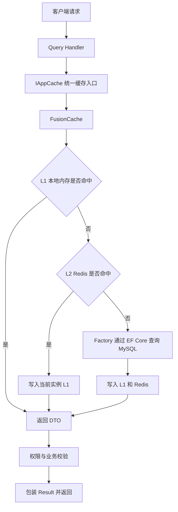

# Redis 与缓存封装

## 1. 背景与目标

在没有缓存的情况下，每次查询请求都需要通过 EF Core 访问 MySQL。随着请求量增加，数据库连接数、SQL 执行次数以及接口响应时间都会随之增加。

本方案通过 FusionCache 统一协调本地内存和 Redis，建立两级缓存：

- L1：应用实例本地内存，访问速度最快。
- L2：Redis 分布式缓存，在多个应用实例之间共享。
- 数据源：MySQL，作为最终可信数据来源。

建设目标如下：

1. 降低热点查询访问 MySQL 的频率。
2. 缩短常用查询接口的响应时间。
3. 支持多实例部署和跨节点缓存失效通知。
4. 统一缓存 Key、TTL、序列化、日志、异常和失效处理。
5. Redis 故障时允许系统按业务策略降级，而不是直接拖垮核心查询。
6. 避免缓存穿透、缓存击穿和集中失效造成的缓存雪崩。

缓存只能作为性能优化手段，MySQL 仍然是业务数据的最终事实来源。

---

## 2. 接入范围

### 2.1 适合接入缓存的数据

- 读取频繁、修改较少的数据。
- 允许短时间内存在旧值的数据。
- 查询成本较高、结果可以复用的数据。
- 商品详情、订单详情、用户展示信息、系统配置等查询数据。

### 2.2 不建议直接缓存的数据

- 账户余额、库存扣减、支付确认等强一致性数据。
- 权限判断结果。
- 当前请求上下文中的临时状态。
- EF Core 跟踪实体和代理对象。
- 包含访问令牌、密码、身份证号等敏感信息的数据。

### 2.3 缓存对象约束

缓存中应保存 DTO 或专用 CacheModel：

```text
推荐：AppOrderDto
不推荐：AppOrder EF Core 实体
不推荐：Result<AppOrderDto>
```

`Result<T>` 表达的是当前请求结果，其中可能包含 `Unauthorized`、`Forbidden` 等与当前用户相关的判断，不应作为公共业务数据缓存。

正确流程为：

```text
从缓存获得 DTO
    ↓
执行当前请求的权限判断
    ↓
包装为 Result<T>
    ↓
返回客户端
```

---

## 3. 缓存架构



各组件职责：

| 组件 | 职责 |
|---|---|
| `IAppCache` | 提供统一缓存访问、策略、日志和异常边界 |
| FusionCache | 协调 L1、L2、并发请求、超时和 Fail-Safe |
| MemoryCache | 保存当前应用实例的 L1 缓存 |
| Redis | 保存多实例共享的 L2 缓存 |
| Redis Backplane | 通知其他实例清理本地 L1 缓存 |
| EF Core / MySQL | 在缓存未命中时加载真实数据 |
| `ICacheKeyBuilder` | 统一生成缓存 Key |

Backplane 主要传递缓存失效通知，不负责存储完整业务数据。业务数据通过 `IDistributedCache` 写入 Redis。

### 3.1 推荐注册方式

```csharp
var redisConnection =
    configuration.GetConnectionString("RedisConnection")
    ?? throw new InvalidOperationException(
        "未配置 RedisConnection 连接字符串。");

services.AddStackExchangeRedisCache(options =>
{
    options.Configuration = redisConnection;
    options.InstanceName = "InprovePlan:Prod:";
});

services.AddFusionCache()
    .WithDefaultEntryOptions(new FusionCacheEntryOptions
    {
        Duration = TimeSpan.FromMinutes(3),
        JitterMaxDuration = TimeSpan.FromSeconds(30),

        IsFailSafeEnabled = true,
        FailSafeMaxDuration = TimeSpan.FromHours(1),
        FailSafeThrottleDuration = TimeSpan.FromSeconds(30),

        FactorySoftTimeout = TimeSpan.FromSeconds(1),
        FactoryHardTimeout = TimeSpan.FromSeconds(5),

        DistributedCacheSoftTimeout =
            TimeSpan.FromMilliseconds(500),
        DistributedCacheHardTimeout =
            TimeSpan.FromSeconds(2)
    })
    .WithSystemTextJsonSerializer()
    .WithRegisteredDistributedCache()
    .WithBackplane(new RedisBackplane(
        new RedisBackplaneOptions
        {
            Configuration = redisConnection
        }));
```

如果当前 FusionCache 版本不支持 `WithRegisteredDistributedCache()`，可以使用：

```csharp
.WithDistributedCache(serviceProvider =>
    serviceProvider.GetRequiredService<IDistributedCache>())
```

---

## 4. Key 命名规范

### 4.1 推荐格式

```text
系统名:环境:版本:业务模块:数据类型:业务参数
```

示例：

```text
inprove-plan:prod:v1:order:detail:818715780059205
inprove-plan:prod:v1:user:profile:820052270506053
inprove-plan:prod:v1:product:list:category-10:page-1:size-20
```

如果已经使用 `AddStackExchangeRedisCache` 的 `InstanceName` 添加系统和环境前缀，业务 Key 可以简化为：

```text
v1:order:detail:818715780059205
```

### 4.2 命名要求

1. 全部使用小写英文、数字、冒号和短横线。
2. Key 必须包含业务模块和数据类型。
3. 参数顺序必须固定，分页 Key 必须包含页码、每页数量和影响结果的筛选条件。
4. DTO 结构发生不兼容变更时升级版本号，例如从 `v1` 升级为 `v2`。
5. 禁止直接包含密码、Token、手机号、身份证号等敏感信息。
6. 禁止在业务代码中随意拼接 Key，应通过 `ICacheKeyBuilder` 统一生成。

示例：

```csharp
var key = keyBuilder.Build(
    "v1",
    "order",
    "detail",
    request.Id);
```

---

## 5. TTL 策略

TTL 应根据数据变化频率、一致性要求和数据库查询成本分别设置，不应为所有缓存使用同一个固定时间。

| 数据类型 | 建议 TTL | 说明 |
|---|---:|---|
| 订单详情 | 1～5 分钟 | 状态可能变化，更新后必须主动删除 |
| 商品详情 | 5～30 分钟 | 读取频繁、变化相对较少 |
| 用户展示信息 | 5～15 分钟 | 修改后主动删除 |
| 系统配置 | 10～60 分钟 | 根据配置变更频率决定 |
| 分页列表 | 30 秒～3 分钟 | 失效关联复杂，TTL 不宜过长 |
| 空结果 | 10～60 秒 | 防止缓存穿透，时间应短于正常数据 |

### 5.1 TTL 抖动

为避免大量缓存同时失效，应在基础 TTL 上增加随机抖动：

```csharp
JitterMaxDuration = TimeSpan.FromSeconds(30);
```

例如基础 TTL 为 3 分钟，最终有效期会分散在约 3 分钟到 3 分 30 秒之间。

### 5.2 空值缓存

查询不存在的订单时，可以短时间缓存“无数据”结果，防止相同无效请求反复访问数据库。

建议使用包装类型区分“没有缓存”和“缓存内容为空”：

```csharp
public sealed record CacheEnvelope<T>(
    bool HasValue,
    T? Value);
```

需要注意：`NullValueDuration` 是业务封装中的策略，不会仅凭属性名称自动被 FusionCache 使用。`IAppCache` 必须在得到空结果后显式使用较短 TTL 写入空值包装对象。

---

## 6. 命中与未命中流程

### 6.1 L1 命中

```text
请求进入
→ FusionCache 查询当前实例 MemoryCache
→ L1 命中
→ 直接返回 DTO
```

特点：

- 不访问 Redis。
- 不执行 EF Core 查询。
- 不执行传入的 Factory。
- 通常是延迟最低的路径。

### 6.2 L1 未命中，Redis 命中

```text
请求进入
→ L1 未命中
→ 查询 Redis
→ Redis 命中
→ 反序列化 DTO
→ 写入当前实例 L1
→ 返回 DTO
```

常见场景：

- 应用刚启动或刚扩容。
- 当前实例 L1 已过期。
- 数据由其他应用实例建立缓存。

### 6.3 L1 和 Redis 都未命中

```text
请求进入
→ L1 未命中
→ Redis 未命中
→ 执行 Factory
→ EF Core 查询 MySQL
→ 得到 DTO
→ 写入 L1
→ 序列化并写入 Redis
→ 返回 DTO
```

业务代码只需要调用一次：

```csharp
var order = await appCache.GetOrSetAsync(
    key,
    token => QueryOrderDtoAsync(request.Id, token),
    orderCachePolicy,
    cancellationToken);
```

业务层不需要额外调用 Redis 的 `SetAsync`。只要 FusionCache 已正确绑定 `IDistributedCache`，`GetOrSetAsync` 会在 Factory 成功后自动写入 L1 和 Redis。

### 6.4 并发请求

同一个 Key 在缓存失效后被大量请求同时访问时，FusionCache 会协调并发访问，通常只允许一个请求执行 Factory，其他请求等待或复用结果，以降低数据库瞬时压力。

### 6.5 日志事件说明

建议业务监控只使用高层事件：

```csharp
cache.Events.Hit
cache.Events.Miss
cache.Events.Set
cache.Events.Remove
cache.Events.FailSafeActivate
```

底层事件如 `Memory.Miss`、`Distributed.Miss` 适合调试，不适合直接统计业务请求数量。FusionCache 在并发锁前后可能多次检查同一个缓存层，因此一次业务请求可能产生多个底层 Miss。

FusionCache 的事件处理器默认可能在后台线程执行，所以日志文件的物理行顺序不一定等于事件发生顺序。日志分析应按以下方式进行：

```text
先按 TraceId 分组
再按 OccurrenceTime 排序
```

---

## 7. 失效策略

### 7.1 基本原则

采用 Cache Aside 模式：

```text
先更新数据库
→ 数据库事务提交成功
→ 删除缓存
→ 下次查询重新建立缓存
```

示例：

```csharp
await orderRepository.UpdateAsync(order, cancellationToken);
await unitOfWork.SaveChangesAsync(cancellationToken);

var key = keyBuilder.Build(
    "v1",
    "order",
    "detail",
    order.Id);

await appCache.RemoveAsync(key, cancellationToken);
```

禁止在数据库事务提交之前删除缓存，否则并发查询可能读取旧数据库数据并重新建立旧缓存。

### 7.2 为什么优先删除而不是直接更新缓存

同时更新数据库和缓存需要处理两个存储系统之间的一致性，任何一方失败都可能产生错误数据。删除缓存后由下一次查询重建，流程更简单，也更容易补偿。

### 7.3 多实例失效

启用 Redis Backplane 后：

```text
实例 A 删除缓存
→ 删除实例 A 的 L1
→ 删除 Redis 中的 L2
→ Backplane 发布失效通知
→ 实例 B、C 删除各自的 L1
```

### 7.4 关联缓存失效

修改订单时，除了订单详情，还可能影响：

- 用户订单列表。
- 订单分页结果。
- 订单状态统计。
- 后台管理列表。

对于难以准确枚举的列表缓存，可以采用：

1. 较短 TTL。
2. 版本号 Key。
3. 标签失效功能，前提是当前 FusionCache 版本和存储方案支持。
4. 消息队列或 Outbox 异步发送失效事件。

### 7.5 删除失败补偿

删除 Redis 缓存失败时，应记录 Warning 或 Error，并根据业务重要性使用：

- 有限次数重试。
- 后台补偿任务。
- 消息队列。
- Outbox 事件表。

不能通过无限重试阻塞当前业务请求。

---

## 8. 异常降级策略

### 8.1 Redis 读取异常

预期路径：

```text
L1 未命中
→ Redis 超时或不可用
→ 在限定时间内跳过 L2
→ 执行 Factory 查询 MySQL
→ 写入 L1
```

Redis 故障可以导致性能下降，但不应默认导致普通查询完全不可用。

### 8.2 Redis 写入异常

数据库查询成功但 Redis 写入失败时：

- 当前请求仍可返回查询结果。
- L1 可以继续提供当前实例缓存。
- 记录 Redis 写入异常。
- Redis 恢复后由后续请求重新建立 L2 缓存。

### 8.3 Factory 异常

Factory 是数据库或其他真实数据源的加载逻辑。执行失败时：

- 没有可用旧值：向上抛出异常，由全局异常处理中间件统一响应。
- 存在符合条件的旧值且启用 Fail-Safe：可以返回旧值。

### 8.4 Fail-Safe

Fail-Safe 允许缓存已经过期、但数据源异常时暂时返回旧数据：

```text
缓存已过期
→ 尝试查询数据库
→ 数据库异常或超时
→ 返回仍处于 Fail-Safe 窗口内的旧值
```

适合：

- 商品展示信息。
- 新闻内容。
- 用户非关键展示信息。
- 系统配置读取。

不适合：

- 支付状态确认。
- 账户余额。
- 库存扣减。
- 权限判断。
- 优惠资格确认。

### 8.5 超时策略

建议分别配置：

- `DistributedCacheSoftTimeout`：Redis 软超时。
- `DistributedCacheHardTimeout`：Redis 最大等待时间。
- `FactorySoftTimeout`：存在旧缓存时的快速降级阈值。
- `FactoryHardTimeout`：Factory 最大等待时间。

所有超时值都应结合接口 SLO、数据库基线和 Redis 网络延迟进行压测后确定。

---

## 9. 验证记录

### 9.1 已观察请求

接口：

```text
GET /api/AppOrder/818715780059205
```

第一次请求的 `TraceId`：

```text
20b3a318578ef549fbfa26dbff5d9031
```

按 `OccurrenceTime` 排序后可以观察到：

```text
http.request.started
cache.miss
cache.loaded
cache.miss
cache.loaded
cache.hit
http.request.completed
```

说明：

- 日志文件中的物理行存在轻微乱序。
- 事件处理和异步日志写入不会保证严格的文件行顺序。
- 多次 `miss/loaded` 可能来自 L1、L2 底层事件或事件重复映射。
- 应检查自定义 `cache.loaded` 实际绑定的是高层 `Set`、Memory Set、Distributed Set，还是 Factory 加载完成。

第二次请求：

```text
TraceId: 50061de0c94c6077719635f5f18440c9
流程: http.request.started → cache.hit → http.request.completed
```

说明缓存成功命中，没有再次执行正常的数据库回源流程。

随后约两分钟后再次出现：

```text
cache.miss
cache.loaded
```

这与缓存 TTL 到期后重新加载的行为相符。实际过期时间还可能受到 `JitterMaxDuration` 影响。

### 9.2 Redis 写入验证

首次请求完成后执行：

```bash
redis-cli --scan --pattern "*order*"
```

检查 Key 剩余 TTL：

```bash
TTL "InprovePlan:Prod:v1:order:detail:818715780059205"
```

返回值说明：

| 返回值 | 含义 |
|---:|---|
| 正数 | 剩余过期秒数 |
| `-1` | Key 存在但没有过期时间 |
| `-2` | Key 不存在 |

不应在生产 Redis 上执行 `KEYS *`。

### 9.3 L2 命中验证

1. 第一次请求接口，确认产生 EF Core SQL。
2. 确认 Redis 中存在对应 Key。
3. 重启应用，清空 L1 本地缓存。
4. 再次请求相同接口。
5. 如果接口正常返回且没有执行 EF Core SQL，则说明从 Redis L2 命中。

### 9.4 失效验证

1. 查询订单并建立缓存。
2. 修改订单并提交数据库事务。
3. 调用 `RemoveAsync` 删除缓存。
4. 确认 Redis Key 被删除。
5. 再次查询，确认执行 EF Core SQL并返回最新数据。
6. 多实例部署时，确认其他实例的 L1 同步失效。

### 9.5 故障验证

生产接入前至少测试：

- Redis 不可连接。
- Redis 响应超时。
- Redis 中存在无法反序列化的旧数据。
- MySQL 查询超时。
- Factory 抛出异常。
- 多个请求同时访问同一个过期 Key。
- 缓存删除失败。
- 应用重启后从 L2 恢复缓存。
- Backplane 消息异常或丢失。

---

## 10. 风险与限制

### 10.1 缓存与数据库不是强一致

Cache Aside 模式只能实现最终一致性。数据库事务提交和缓存删除之间仍然存在短暂时间窗口。

强一致业务应直接以数据库或专门的一致性方案为准，不能仅依赖缓存。

### 10.2 Redis 不是事实数据源

Redis 数据可能因为过期、淘汰、重启、故障或人工操作而消失。系统必须能够从 MySQL 重建缓存。

### 10.3 缓存雪崩

大量 Key 同时到期会造成数据库流量突增。需要通过 TTL 抖动、分批预热和限流控制。

### 10.4 缓存击穿

热点 Key 到期时可能出现大量并发回源。FusionCache 能够对同一个 Key 进行并发协调，但仍需要合理设置 Factory 超时和数据库容量。

### 10.5 缓存穿透

重复查询不存在的数据会绕过正常缓存。应使用短 TTL 空值缓存、参数校验和必要的接口限流。

### 10.6 大对象和序列化成本

缓存过大的 DTO 或列表会增加：

- Redis 内存占用。
- 网络流量。
- JSON 序列化和反序列化耗时。
- .NET GC 压力。

应避免缓存无边界列表，并限制分页大小和缓存对象字段。

### 10.7 列表缓存失效复杂

一条数据变更可能影响多个筛选条件和分页结果。列表缓存应设置较短 TTL，或使用明确的标签和版本失效方案。

### 10.8 日志量风险

每次缓存命中都记录 `Information` 会产生大量日志。生产环境建议：

- Hit、Miss 使用 `Debug` 或指标统计。
- 删除缓存使用 `Information`。
- Redis 超时和 Fail-Safe 使用 `Warning`。
- 序列化、回源失败使用 `Error`。
- FusionCache 内部日志通常配置为 `Warning`。

### 10.9 事件日志顺序

FusionCache 事件和 Serilog Sink 可能异步处理，不能依靠日志物理行顺序判断调用路径。必须结合 `TraceId`、`OccurrenceTime`、`CacheKey` 和实例标识分析。

### 10.10 敏感数据风险

Redis 中的数据可能被运维工具、备份和监控系统访问。不得缓存密码、访问令牌以及不必要的个人敏感信息；生产 Redis 应启用网络隔离、认证、TLS 和最小权限。

---

## 11. 生产接入检查表

- [ ] Redis 使用高可用部署，不依赖单节点。
- [ ] Redis 连接字符串通过安全配置中心或环境变量管理。
- [ ] 已配置合理的连接、读取和写入超时。
- [ ] Key 包含系统、环境、业务和版本信息。
- [ ] 不缓存 EF Core 实体、权限结果和敏感数据。
- [ ] 正常数据和空结果使用不同 TTL。
- [ ] 已启用 TTL 抖动。
- [ ] 写操作在数据库提交成功后删除缓存。
- [ ] 多实例环境已配置并验证 Backplane。
- [ ] Redis 故障不会直接阻断允许降级的普通查询。
- [ ] 强一致业务未错误启用 Fail-Safe。
- [ ] 已验证 L1 命中、L2 命中、数据库回源和主动失效。
- [ ] 已进行并发、超时、断网和恢复测试。
- [ ] 已监控命中率、回源次数、Redis 延迟和异常次数。
- [ ] 生产环境不会逐条记录高频缓存命中日志。

---

## 12. 总结

本方案使用 FusionCache 作为统一缓存调度器，以本地内存作为 L1、Redis 作为 L2、MySQL 作为最终数据源。

查询时优先访问 L1，其次访问 Redis，两级均未命中时才通过 EF Core 查询数据库并写回缓存；数据更新时先提交数据库事务，再删除缓存，并通过 Backplane 通知其他实例清理本地缓存。

这套方案能够用于生产环境，但必须配合统一 Key、分级 TTL、失效补偿、超时降级、日志指标、安全配置和故障验证，才能真正发挥缓存的性能收益并控制一致性风险。
