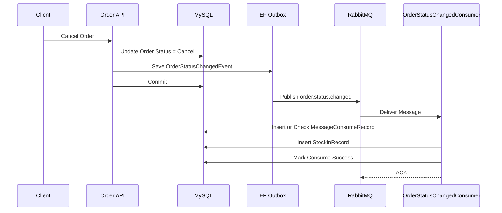
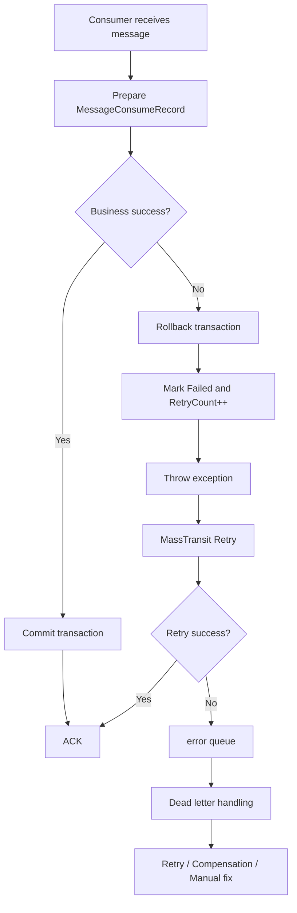
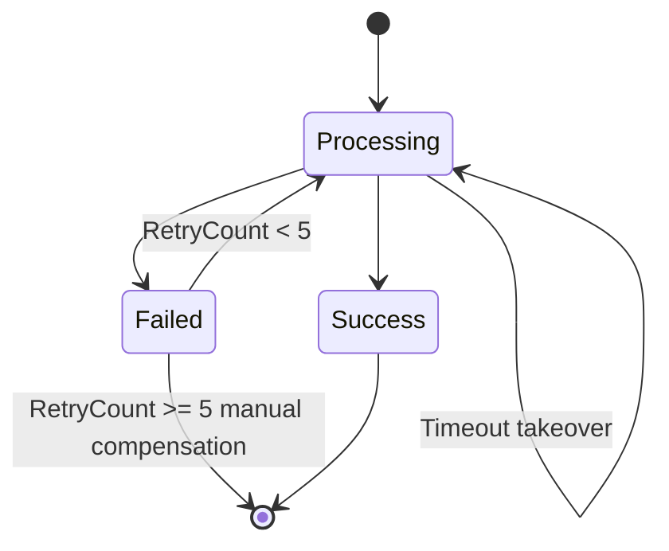

# 06-14 最终一致性流程图

## 1. 目标

### 1.1 文档目的

梳理当前 RabbitMQ 订单状态变更链路的最终一致性设计，明确正常路径、异常路径、补偿路径和人工兜底路径。

### 1.2 最终一致性定义

最终一致性表示系统允许短时间内存在中间状态，但经过 MQ 重试、Outbox 投递、消费幂等、补偿任务和人工处理后，业务结果最终达到预期状态。

### 1.3 本系统最终一致性边界

以订单取消退库存为例：

```text
订单状态 = Cancel
库存退回流水存在
消费记录 = Success
```

## 2. 代码位置

### 2.1 订单状态修改代码

订单 API 或订单服务，待补充具体路径。

### 2.2 Outbox 发布代码

```text
IOrderEventPublisher
OrderEventPublisher
```

### 2.3 RabbitMQ 配置代码

```text
InprovePlan.UserCase\DependencyInjection.cs
```

### 2.4 Consumer 消费代码

```text
InprovePlan.UserCase\Customers\OrderStatusChangedConsumer.cs
```

### 2.5 消费去重表代码

```text
Instructure\Massaging\MessageConsumeRecord.cs
Instructure\Configurations\Entities\MessageConsumeRecordConfiguration.cs
```

### 2.6 库存流水代码

```text
InprovePlan.Domain\Entities\StockInRecord.cs
Instructure\Configurations\Entities\StockInRecordConfiguration.cs
```

### 2.7 补偿任务规划代码

当前未实现。

## 3. 核心设计

### 3.1 核心状态同步落库

订单状态修改由订单服务本地事务完成。

### 3.2 附属动作异步处理

库存退回、通知、积分等动作通过 MQ 异步处理。

### 3.3 Outbox 保证消息最终发出

EF Outbox 保证消息先写数据库，再异步投递 RabbitMQ。

### 3.4 RabbitMQ 负责解耦投递

RabbitMQ 负责将 `OrderStatusChangedEvent` 投递给相关消费者。

### 3.5 Consumer 幂等保证重复不错

消费者通过：

```text
MessageId + ConsumerName
```

进行消息级幂等。

### 3.6 Retry / Dead Letter 处理失败

MassTransit Retry 处理临时失败。超过重试上限后进入 error queue。

### 3.7 补偿任务保证最终结果一致

补偿任务用于扫描业务不一致，例如订单已取消但库存未退。

### 3.8 人工运维兜底

死信处理后台和 Runbook 用于处理自动恢复不了的问题。

## 4. 正常流程图

### 4.1 Mermaid 流程图



### 4.2 客户端请求

客户端调用订单取消接口。

### 4.3 订单 API

订单 API 完成核心状态修改。

### 4.4 数据库事务

订单状态和 Outbox 消息在同一业务事务内提交。

### 4.5 Outbox

Outbox 后台服务投递消息。

### 4.6 RabbitMQ

消息进入 exchange：

```text
order.status.changed
```

### 4.7 Consumer

消费者执行库存退回。

### 4.8 ACK

消费者正常结束后 ACK。

## 5. 异常流程图

### 5.1 Mermaid 流程图



### 5.2 RabbitMQ 不可用

Outbox 保留消息，待 RabbitMQ 恢复后继续投递。

### 5.3 Outbox 投递失败

依赖 MassTransit Outbox 重试，并需要监控 Outbox 积压。

### 5.4 Consumer 失败

消费者回滚事务，记录 Failed，并抛异常触发 Retry。

### 5.5 Retry 失败

消息进入 error queue。

### 5.6 进入死信

死信等待运维或后台归集处理。

### 5.7 人工处理

人工判断：

- 重投。
- 标记已处理。
- 创建补偿。
- 修复数据。

### 5.8 补偿任务

补偿任务扫描业务不一致并修复。

## 6. 去重与补偿流程图

### 6.1 MessageConsumeRecord 状态流转



### 6.2 StockInRecord 业务幂等

```text
SourceBusinessId + SourceAction
```

保证同一订单同一业务动作只执行一次。

### 6.3 Processing 超时接管

超过 5 分钟后允许新消费者接管。

### 6.4 Failed 重试

`RetryCount < 5` 时允许重新处理。

### 6.5 DeadLetterHandleRecord 处理

当前未实现。建议纳入死信归集。

### 6.6 CompensationRecord 补偿

当前未实现。建议纳入业务补偿闭环。

## 7. 请求/消息示例

### 7.1 正常订单取消请求

```http
POST /api/orders/10001/cancel
Idempotency-Key: client-key-001
```

### 7.2 OrderStatusChangedEvent

```json
{
  "messageId": "5c7f7e62-66a9-4d54-bd42-28c1d0b84c01",
  "orderId": 10001,
  "fromStatus": "PendingPayment",
  "toStatus": "Cancel",
  "occurredAt": "2026-07-13T10:00:00+08:00"
}
```

### 7.3 重复消息

同 `MessageId` 再次投递。

### 7.4 死信消息

待 RabbitMQ error queue 导出。

### 7.5 补偿任务输入

```json
{
  "businessType": "Order",
  "businessId": 10001,
  "action": "ReturnStockForOrderCancel"
}
```

## 8. 数据库记录截图或 SQL 结果

### 8.1 订单状态记录

```sql
SELECT id, status
FROM app_orders
WHERE id = 10001;
```

### 8.2 Outbox 记录

```sql
SELECT *
FROM OutboxMessage
ORDER BY SequenceNumber DESC
LIMIT 10;
```

### 8.3 消费记录

```sql
SELECT *
FROM message_consume_records
WHERE business_id = 10001;
```

### 8.4 库存流水

```sql
SELECT *
FROM stock_in_records
WHERE source_business_id = 10001
  AND source_action = 'ReturnStockForOrderCancel';
```

### 8.5 死信处理记录

待实现。

### 8.6 补偿记录

待实现。

## 9. RabbitMQ 队列截图或管理台截图

### 9.1 Exchange

待补充。

### 9.2 Queue

待补充。

### 9.3 Binding

待补充。

### 9.4 Consumer

待补充。

### 9.5 Error Queue

待补充。

## 10. 日志证据

### 10.1 正常链路 TraceId

待补充。

### 10.2 异常链路 TraceId

待补充。

### 10.3 Retry 日志

待补充。

### 10.4 死信日志

待补充。

### 10.5 补偿日志

待实现。

## 11. 风险与未完成项

### 11.1 最终一致性延迟

异步链路天然存在延迟，需对用户体验和业务查询做说明。

### 11.2 死信处理后台未完成

缺少死信归集和人工处理。

### 11.3 补偿任务未完成

缺少业务对账补偿任务。

### 11.4 告警体系未完成

缺少队列、死信、Outbox、Failed 告警。

### 11.5 人工 Runbook 未完成

缺少标准人工处理流程。

### 11.6 分布式事务误区

当前设计不是分布式事务，而是基于 Outbox、MQ、幂等和补偿实现最终一致性。

## 12. 结论

### 12.1 最终一致性链路是否成立

主链路成立。

### 12.2 当前生产成熟度

代码层具备基础能力，运维闭环尚未完整。

### 12.3 生产准入判断

```text
生产有条件通过
```

